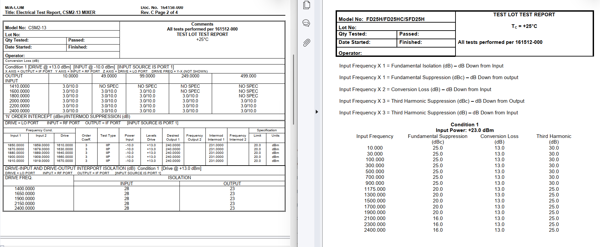
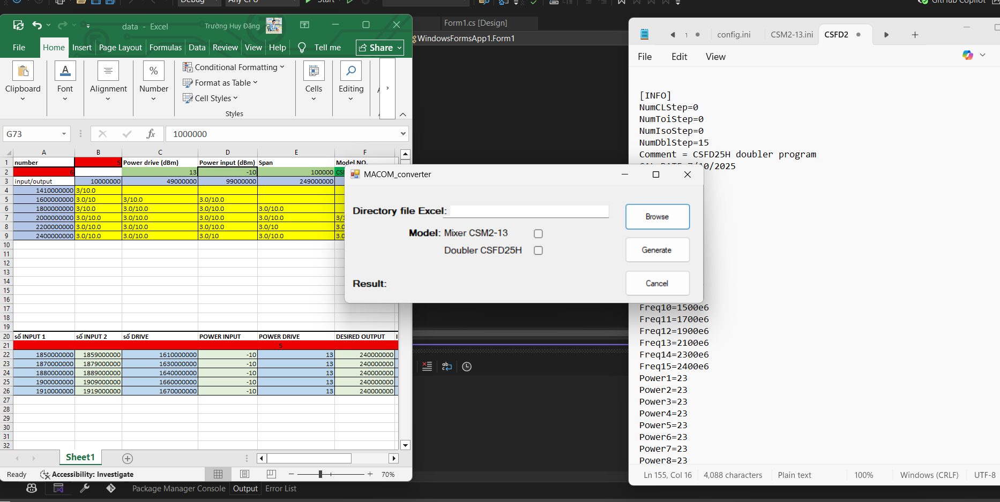

# A WinForms project
This repository contains the source code and files for my "converter" app. I built this C# application by using WinForms-based user interface (.NET framework) in Visual Code.
# Description
The test lot report is an important PDF-formatted file report for the testing lot of electrical model products.
The configuration file is an INI file that stores data used to customize parameters, preferences, and alternative settings for test machine to operate properly. Its format needs to keep unchanged. the change is the parameters.
As usual, staffs are responsible for typing data from the test lot report into the file INI. However, it still seems inefficient, time-consuming and easily mistaken if they do it manually. To find the better solution for it, I build a based-C# WinForms application for the automative data typing. Staffs only need to type data in Excel file which is the same format as the report file - their most satisfactory way, then the program will convert the rest of the work into file INI without having any difficulty. 
Here is the sample of file report:
 
# Technologies used
1. Windows Forms App (.NET framework).
2. C# programming language in Visual Studio.
3. Library used: EPPLus for access to file Excel.
# Features
Name app: WindowsFormsApp1_1_0_0_0
1. Directory of file Excel: browse to find targeted Excel file directory.
2. Model: choose which model to be converted.
3. The output INI file will be stored in local folder set by program.
4. Publish application and ready to install and use it in desktop PC without running all source code in Visual Studio.
 
# Update version
New version: WindowsFormsApp1_1_0_0_1
Update date: 24/07/2025 
New features:
1. Users can choose their own desired output folder path where the file INI stores, instead of the unchangeable directory before
2. Update some message boxs popup when errors.
